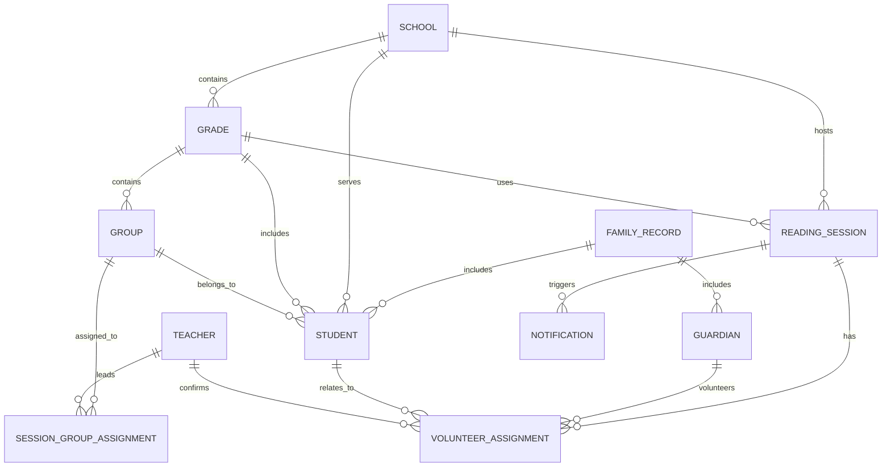

# Data Model

## Overview
The data model is relational and entity-based. Each major domain object is stored with explicit relationships and operational metadata.

## Core Tables
### schools
- id: UUID PK
- name: VARCHAR
- address: TEXT
- level: VARCHAR
- timezone: VARCHAR
- locale: VARCHAR
- status: ENUM
- created_at, updated_at

### grades
- id: UUID PK
- school_id: UUID FK -> schools.id
- name: VARCHAR
- academic_period: VARCHAR NULL
- status: ENUM
- created_at, updated_at

### groups
- id: UUID PK
- grade_id: UUID FK -> grades.id
- name: VARCHAR
- code: VARCHAR
- status: ENUM
- created_at, updated_at

### teachers
- id: UUID PK
- name: VARCHAR
- email: VARCHAR UNIQUE
- phone: VARCHAR NULL
- avatar_url: TEXT NULL
- status: ENUM
- created_at, updated_at

### family_records
- id: UUID PK
- display_name: VARCHAR
- avatar_url: TEXT NULL
- status: ENUM
- created_at, updated_at

### guardians
- id: UUID PK
- family_id: UUID FK -> family_records.id
- name: VARCHAR
- email: VARCHAR NULL
- phone: VARCHAR NULL
- relationship: VARCHAR
- supported_languages: JSONB
- notification_preferences: JSONB
- status: ENUM
- created_at, updated_at

### students
- id: UUID PK
- family_id: UUID FK -> family_records.id
- school_id: UUID FK -> schools.id
- grade_id: UUID FK -> grades.id
- group_id: UUID FK -> groups.id
- name: VARCHAR
- dob: DATE NULL
- photo_url: TEXT NULL
- status: ENUM
- created_at, updated_at

### reading_sessions
- id: UUID PK
- school_id: UUID FK -> schools.id
- grade_id: UUID FK -> grades.id
- session_date: DATE
- start_time: TIME
- end_time: TIME
- timezone: VARCHAR
- status: ENUM
- notes: TEXT NULL
- created_at, updated_at

### session_group_assignments
- id: UUID PK
- session_id: UUID FK -> reading_sessions.id
- group_id: UUID FK -> groups.id
- teacher_id: UUID FK -> teachers.id
- language: VARCHAR
- status: ENUM
- created_at, updated_at

### volunteer_assignments
- id: UUID PK
- session_id: UUID FK -> reading_sessions.id
- group_id: UUID FK -> groups.id
- guardian_id: UUID FK -> guardians.id
- student_id: UUID FK -> students.id
- teacher_id: UUID FK -> teachers.id
- language: VARCHAR
- status: ENUM
- book_title: VARCHAR NULL
- image_url: TEXT NULL
- cancellation_reason: TEXT NULL
- replacement_for: UUID NULL FK -> volunteer_assignments.id
- created_at, updated_at

### notifications
- id: UUID PK
- session_id: UUID NULL FK -> reading_sessions.id
- assignment_id: UUID NULL FK -> volunteer_assignments.id
- type: ENUM
- channel: ENUM
- status: ENUM
- scheduled_for: TIMESTAMP
- sent_at: TIMESTAMP NULL
- provider_message_id: VARCHAR NULL
- retry_count: INT
- idempotency_key: VARCHAR UNIQUE
- created_at, updated_at

## Constraints and Indexes
- Unique email for admin and teacher accounts where relevant
- Unique invite token per registration flow
- Indexes on school_id, grade_id, session_id, group_id, guardian_id, and status
- Soft-delete or archive strategy for historical records when purging is not permitted

## ER Diagram

## Data Retention
- Keep historical participation data intact even when a volunteer or session is canceled or replaced.
- Use archival or soft-delete boundaries to avoid breaking historical timeline queries.
- Keep audit records separate from current operational state where practical.
