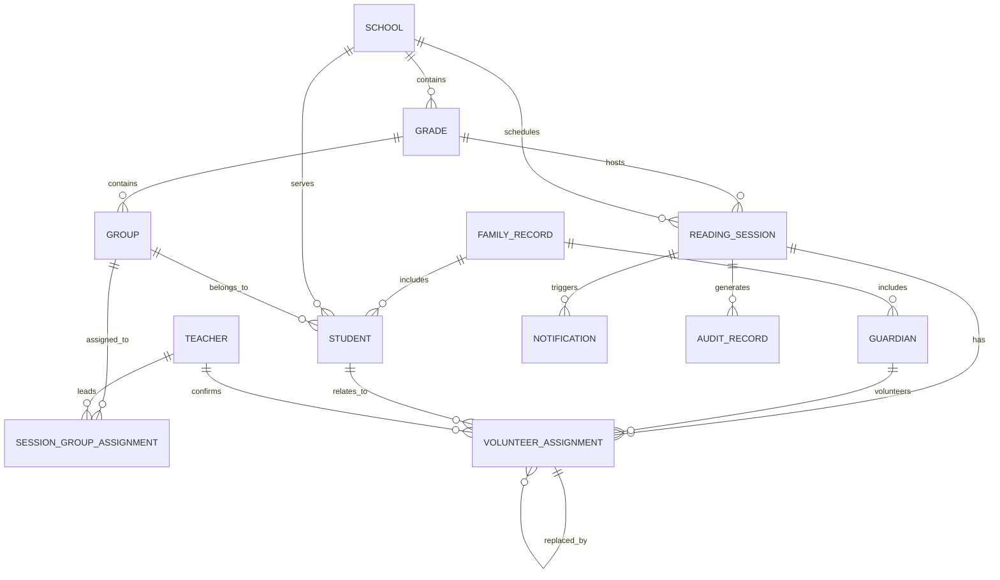

# Data Model: Smart Agenda MVP

## Overview

The Smart Agenda data model is relational and designed around explicit business ownership between schools, families, sessions, and notifications. The model allows operational history to remain intact even when volunteers cancel or are replaced.

## Core Entity Definitions

### School
Represents the institution running the reading program.

Fields:
- id: UUID primary key
- name: string
- address: text, optional
- timezone: string
- locale: string
- status: enum (active, archived)
- created_at, updated_at

### Grade
Represents an academic cohort within a school.

Fields:
- id: UUID primary key
- school_id: UUID foreign key to School
- name: string
- academic_period: string, optional
- status: enum
- created_at, updated_at

### Group
Represents a cohort or reading group that participates in a session.

Fields:
- id: UUID primary key
- grade_id: UUID foreign key to Grade
- name: string
- code: string
- status: enum
- created_at, updated_at

### Teacher
Represents a staff member assigned to a reading session or group.

Fields:
- id: UUID primary key
- name: string
- email: unique string
- phone: optional string
- avatar_url: optional string
- status: enum
- created_at, updated_at

### FamilyRecord
Represents one household account with associated guardians and children.

Fields:
- id: UUID primary key
- display_name: string
- avatar_url: optional string
- status: enum
- created_at, updated_at

### Guardian
Represents a parent or family contact.

Fields:
- id: UUID primary key
- family_id: UUID foreign key to FamilyRecord
- name: string
- email: optional string
- phone: optional string
- relationship: string
- supported_languages: json
- notification_preferences: json
- status: enum
- created_at, updated_at

### Student
Represents a child associated with a family and school.

Fields:
- id: UUID primary key
- family_id: UUID foreign key to FamilyRecord
- school_id: UUID foreign key to School
- grade_id: UUID foreign key to Grade
- group_id: UUID foreign key to Group
- name: string
- dob: date, optional
- photo_url: optional string
- status: enum
- created_at, updated_at

### ReadingSession
Represents a scheduled reading event.

Fields:
- id: UUID primary key
- school_id: UUID foreign key to School
- grade_id: UUID foreign key to Grade
- session_date: date
- start_time: time
- end_time: time
- timezone: string
- status: enum (draft, scheduled, confirmed, cancelled, completed)
- notes: text, optional
- created_at, updated_at

### SessionGroupAssignment
Represents a group-specific assignment for a session.

Fields:
- id: UUID primary key
- session_id: UUID foreign key to ReadingSession
- group_id: UUID foreign key to Group
- teacher_id: UUID foreign key to Teacher
- language: string
- status: enum
- created_at, updated_at

### VolunteerAssignment
Represents a guardian or family volunteer assignment for a group/session.

Fields:
- id: UUID primary key
- session_id: UUID foreign key to ReadingSession
- group_id: UUID foreign key to Group
- guardian_id: UUID foreign key to Guardian
- student_id: UUID foreign key to Student, optional
- teacher_id: UUID foreign key to Teacher
- language: string
- status: enum (pending, confirmed, cancelled, replaced, completed)
- book_title: optional string
- image_url: optional string
- cancellation_reason: optional text
- replacement_for: UUID, optional foreign key to VolunteerAssignment
- created_at, updated_at

### Notification
Represents an outbound notification related to a session or volunteer assignment.

Fields:
- id: UUID primary key
- school_id: UUID foreign key to School; required for school-scoped authorization and history
- session_id: UUID foreign key to ReadingSession, optional
- assignment_id: UUID foreign key to VolunteerAssignment, optional
- recipient_id: canonical recipient identity reference; contact destination is resolved at dispatch time and is not copied into queue metadata
- type: enum (request, reminder, confirmation, cancellation, replacement, teacher_notice)
- channel: enum (email, sms, whatsapp)
- status: enum (queued, sending, sent, delivered, failed, cancelled)
- scheduled_for: timestamp
- sent_at: timestamp, optional
- provider_message_id: string, optional
- retry_count: integer
- idempotency_key: unique string
- created_at, updated_at

### NotificationAttempt
Append-only record of one adapter dispatch attempt. Queue acceptance is not a delivery attempt and is not represented as `sent`.

Fields:
- id: UUID primary key
- notification_id: UUID foreign key to Notification
- attempt_number: positive integer, unique per notification
- provider_key: configured provider/adapter identifier
- outcome: enum (accepted, delivered, retryable_failure, permanent_failure, simulated)
- provider_message_id: string, optional
- safe_failure_code: string, optional; must not contain secrets, recipient addresses, or message content
- started_at, completed_at: timestamps
- retry_after: timestamp, optional
- created_at: timestamp

Consent/suppression requirements and stored provenance must follow the channel policy approved before production dispatch. Attempt rows never duplicate phone numbers or email addresses.

### AuditRecord
Stores historical changes and operational actions that must remain visible.

Fields:
- id: UUID primary key
- entity_type: string
- entity_id: UUID
- action: string
- actor_id: UUID, optional
- metadata: json
- created_at

## Relationship Summary

- One School has many Grades
- One School has many Notifications
- One Grade has many Groups and ReadingSessions
- One Group is assigned to many SessionGroupAssignments
- One Teacher may lead many SessionGroupAssignments and VolunteerAssignments
- One FamilyRecord has many Guardians and Students
- One ReadingSession has many VolunteerAssignments and Notifications
- One Notification has many NotificationAttempts
- One VolunteerAssignment may be replaced by another VolunteerAssignment using replacement_for
- AuditRecord stores history independent of current record state

## Constraints and Rules

- Unique email for teacher and admin accounts where relevant
- Unique idempotency keys for duplicate-safe notification creation
- Prevent duplicate assignment for the same guardian and session/group when a live assignment exists
- Preserve historical records even when a volunteer is cancelled or replaced
- Enforce school scope and family scope on all guest-visibility queries

## Index Recommendations

- school_id on school-related tables
- grade_id and group_id on session and assignment queries
- session_id and status on VolunteerAssignment and Notification
- school_id, status, and scheduled_for on Notification; notification_id and created_at on NotificationAttempt
- guardian_id and family_id on family activity queries
- created_at for recent dashboard and timeline queries

## ER Diagram

## Data Retention Guidance

- Keep current operational records and historical audit records in distinct tables or versions where possible.
- Use logical deletion or archived status rather than physical deletion for protected family or session history.
- Allow simple dashboard queries that read active state and recent audit history without heavy joins.
